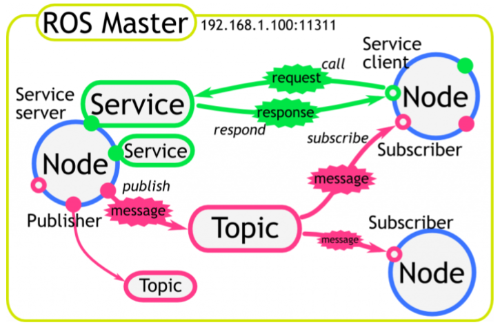

# ROS1 Melodic Installation for Ubuntu 18.04/20.04

- targets: ROS 1 (Melodic) Installation and Implementation.

Installation Options
---

| | ROS Kinetic Kame | ROS Melodic Morenia | ROS Noetic Ninjemys |
| ---- | ---- | ---- | ---- |
| Release Date | May, 2016 | May, 2018 | May, 2020 |
| Supported Date | April, 2021 | May, 2023 | May, 2025 |
| Ubuntu Version Minimum Required | Not recommended to install | Ubuntu 18.04 | Ubuntu 20.04 |


Installation of ROS Melodic
---

1. Setup your sources.list

    ```bash=
    sudo sh -c 'echo "deb http://packages.ros.org/ros/ubuntu $(lsb_release -sc) main" > /etc/apt/sources.list.d/ros-latest.list'
    ```

2. Set up your keys

    ```bash=
    sudo apt install curl # if you haven't already installed 
    curl curl -s https://raw.githubusercontent.com/ros/rosdistro/master/ros.asc | sudo apt-key add -
    ```

3. Installation

    ```bash=
    sudo apt update
    ```

    - Desktop-Full install: (Recommended)

    ```bash=
    # Included ROS, rqt, rviz, robot-generic libraries, 2D/3D simulators and 2D/3D perception.
    sudo apt install ros-melodic-desktop-full
    ```

    - Desktop install:

    ```bash=
    # Included ROS, rqt, rviz, and robot-generic libraries.
    sudo apt install ros-melodic-desktop
    ```

    - ROS-Base: (Bare Bones):

    ```bash=
    # Included ROS package, build, and communication libraries. No GUI tools.
    sudo apt install ros-melodic-ros-base
    ```

4. Individual package

    ```bash=
    sudo apt install ros-melodic-PACKAGE
    apt search ros-melodic # To find available packages, use this command.
    ```

5. Environment setup

    ```bash=
    echo "source /opt/ros/melodic/setup.bash" >> ~/.bashrc
    source ~/.bashrc
    ```

6. Install dependencies for building packages

    ```bash=
    sudo apt install python-rosdep python-rosinstall python-rosinstall-generator python-wstool build-essential
    ```

7. Initialize rosdep

    ```bash=
    sudo apt install python-rosdep
    sudo rosdep init
    rosdep update
    ```

8. Check the current ROS environment

    ```bash=
    # melodic (ROS1)
    printenv | grep ROS
    ```

---

ROS 1 Architecture
---

- Master
- Node
- Topic

    

ROS Test
---

1. ROS Master

    ```bash=
    # terminal 1
    roscore 
    ```

2. ROS Subscriber

    ```bash=
    # terminal 2
    rosrun turtlesim turtlesim_node 
    ```

3. ROS Publisher

    ```bash=
    # terminal 3
    rosrun turtlesim turtle_teleop_key 
    ```

4. List every running Topics

    ```bash=
    rostopic list
    ```

5. Check detail information of single Topic

    ```bash=
    rostopic info {topic_name}
    ```

6. Display Nodes structure of ROS Master 

    ```bash=
    rqt_graph
    ```

---

Implementation of ROS Melodic
---

### Implementation - ROS workspace create

1. ROS 1 Melodic environment setup

    ```bash=
    source /opt/ros/melodic/setup.bash
    ```

2. Create a workspace

    ```bash=
    cd
    mkdir -p ~/catkin_ws/src
    ```

3. Make workspace

    ```bash=
    cd catkin_ws
    catkin_make
    ```

4. Source this folder as ROS workspace

    ```bash=
    source devel/setup.bash
    ```

### Implementation - ROS package create

1. Create a package

    ```bash=
    cd src

    # catkin_create_pkg {folder name} {depend}
    catkin_create_pkg test rospy

    cd ..
    catkin_make
    ```

2. Open new terminal, check workspace & package

    ```bash=
    . ~/catkin_ws/devel/setup.bash
    roscd test/
    ```

### Implementation - ROS publisher & subscriber create

1. Clone the example code

    ```bash=
    git clone https://github.com/ycpranchu/ros1-installation.git

    cp ros1-installation/src/helloworld.py src/helloworld.py
    cp ros1-installation/src/helloworld_listener.py src/helloworld_listener.py
    ```

2. ROS Master

    ```bash=
    # terminal 1
    roscore 
    ```

3. Create the publisher Node

    ```bash=
    # terminal 2
    . ~/catkin_ws/devel/setup.bash
    roscd test/src
    chmod +x helloworld.py
    rosrun test helloworld.py
    ```

4. Create the subscriber Node

    ```bash=
    # terminal 3
    . ~/catkin_ws/devel/setup.bash
    roscd test/src
    chmod +x helloworld_listener.py
    rosrun test helloworld_listener.py
    ```

5. Use **rostopic** to list the current Topic

    ```bash=
    rostopic list
    ```

6. Display Nodes structure by GUI tool

    ```bash=
    rqt_graph
    ```

---

Official Document
---

- [ROS Melodic Morenia](http://wiki.ros.org/melodic)
- [ROS Noetic Ninjemys](http://wiki.ros.org/noetic)